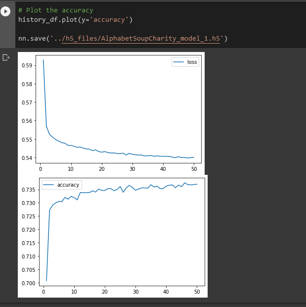
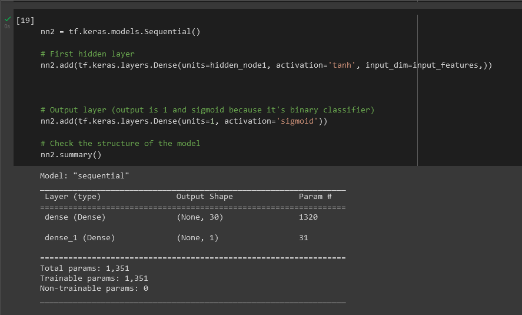
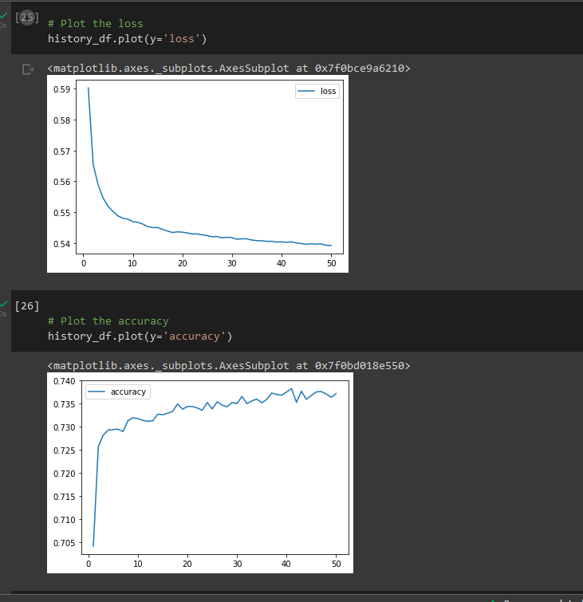
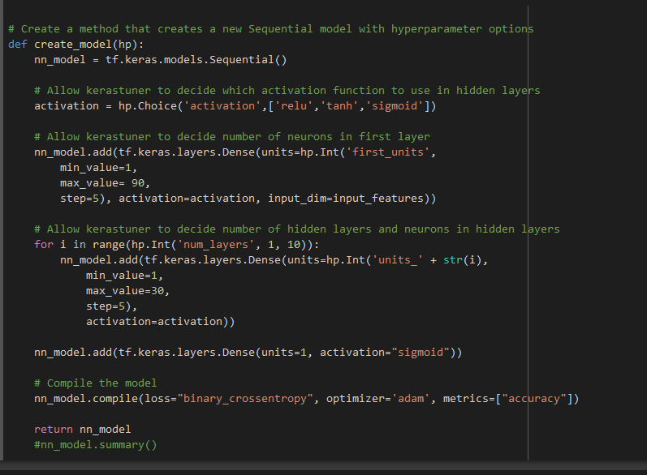
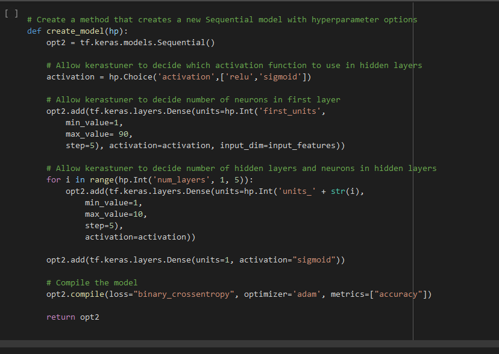
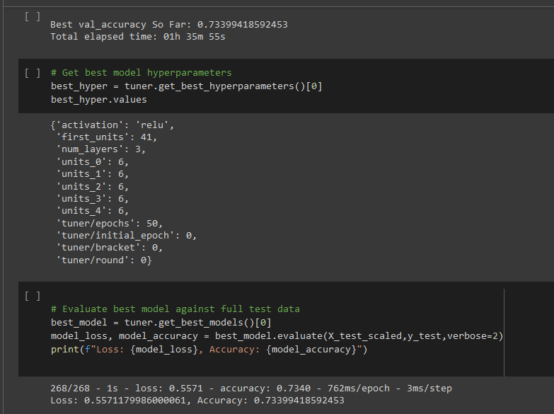
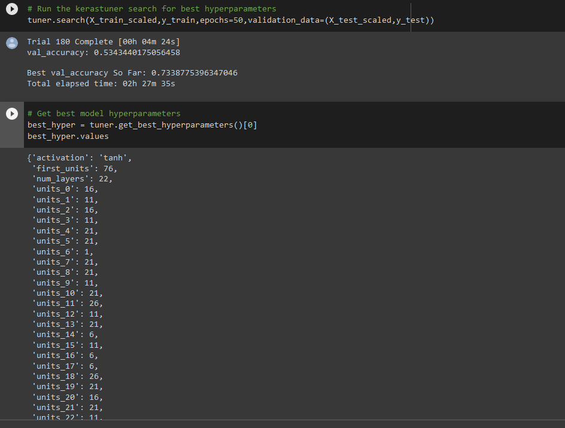

# deep-learning-challenge
# Charity Funding Predictor
 
## OVERVIEW
The goal of this project is to create an algorithm using machine learning and neural networks to predict whether applicants will be successful if funded by the fictional non-profit foundation, Alphabet Soup.

## PROCESS

A csv file was provided to make this determination. This file contained 34,299 organizations that have received funding from the fictional foundation as well as some possible features to assist in finding a useable model.

## PREPROCESSING

    <li> Dropped columns `EIN`, `NAME`, later determined to drop `STATUS` column as well</li>
    <li> Found the number of data points for each unique value for each of the columns that had more than 10 unique values:
         `APPLICATION_TYPE`, `CLASSIFICATION`, and `ASK_AMT`
    choosing a cutoff point to bin rare categorical values together into a new value called "Other" in the case of `APPLICATION_TYPE` and `CLASSIFICATION`, and binned `ASK_AMT` into 4 ranges of ask amounts</li>
    <li> Used pd.get_dummies() to convert categorical data to numeric </li>
    <li> Divided the data into target array (IS_SUCCESSFUL) and features arrays </li>
    <li> Applied the train_test_split to create a testing and a training dataset </li>
    <li> Used StandardScaler to scale the training and testing sets </li>

The data included 43 features. The target variable (y) was `IS_SUCCESSFUL`. The data was split into training and test subsets.

## COMPILING, TRAINING, AND EVALUATING THE MODEL
The model was required to achieve a target predictive accuracy higher than 75%. I made three official attempts using machine learning and neural networks. They all resulted in the same accuracy rate – right around 72%, so a little short of the required target accuracy.

Results from each model attempt are detailed below:

### MODEL 1
The first attempt [model 1](Models/AlphabetSoupCharity_model_1.h5) resulted in an accuracy score of 72.83%. At this point, I decided to drop an additional column `STATUS` to reduce feature numbers in the hopes of increasing accuracy as well as binned the `ASK_AMT` for the next model attempt.

The hyperparameters used were:

    layers = 3
        layer1 = 30 neurons : activation function = `relu`
        layer2 = 10 neurons : activation function = `relu`
        layer3 = 10 neurons : activation function = `relu`
    epochs = 50
 
### Model 1 Accuracy Plot

### MODEL 2
For my second attempt [model 2](Models/AlphabetSoupCharity_model_2.h5) I dropped the column `STATUS`, and binned the column `ASK_AMT` into 4 bins as well as reduced the number of layers to 1. This attempt resulted in an accuracy score of 73.02%. This means that 73.02% of the model’s predicted values align with the dataset’s true values.

The hyperparameters used were:

    layers = 1
        layer1 = 30 neurons : activation function = `tahn`
    epochs = 50

Model 2 Accuracy Plot
 
 

### OPTIMIZATION 1
Now that I have -what I consider- a pre-processed dataframe with Model 2, I need to optimize it to see if we can reach 75% accuracy with the model.[Optimization 1](Models/AlphabetSoupCharity_Optimization1.h5) I Created a new model using preprocessing steps from Model 2, and gave `kerastuner` the option to choose the best activation type for the model (`tahn`,`relu`,`sigmoid`) with a 1 (number of hidden layers, and 10 as the number of neurons) 
 

The result was a 73.4% accuracy, slightly better than the original `Model 2`.

### OPTIMIZATION 2
I decided for Optimization 2, to reduce the number of neurons in the model, keeping the preprocessing done in Model 2- since it gave the highest accuracy of the two pre-processing attempts.
[Optimization 2](Models/AlphabetSoupCharity_Optimization2.h5) 
 
We can see that there was a slight increase to 73.99% in accuracy.
 

### OPTIMIZATION 3
Since the increase was so slight, I increased the neurons from 10 to 40. (Images/opt3_layers.PNG) 
The accuracy dropped slightly from 73.99 to 73.38.  
[Optimization 3](Models/AlphabetSoupCharity_Optimization3.h5) 

## SUMMARY

In the three attempts I made, the model was unable to achieve a target predictive accuracy higher than 73.99%. Hypertuning resulted in nearly no improvement. I would consider adding another feature to see if this increases accuracy, but the issue is more likely a dataset issue. There are only about 34,000 rows of data to work with. The small dataset would leave me less than confident to implement these models. 
